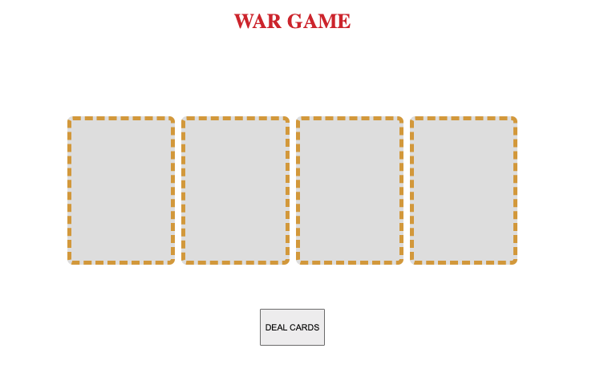
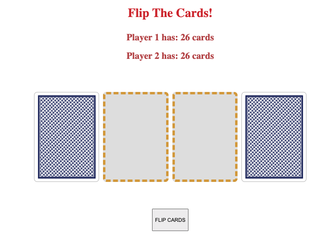

# War-Card-Game

## Background

The reason I chose this game was beacause this was the first card game I remember playing.

## Goal

The goal is to be the first player to win all 52 cards

## The Deal

The deck is divided evenly, with each player receiving 26 cards. Each player places their stack of cards face down, in front of them.

## The Play

Each player turns up a card at the same time and the player with the higher card takes both cards and puts them, face down, on the bottom of his stack.

If the cards are the same rank, it is War!

## WAR

Each player turns up three cards face down and one card face up. The player with the higher ranking card takes both piles and the cards flipped. If the turned-up cards are again the same rank it is war again!

[Pseudo-code found here](https://docs.google.com/document/d/1S9qRhC-t8bSbKKMr4UvPn8EK2eHHP2wnOngsH9SNDb0/edit)

## Deployment link 

https://war-game-by-marcus.netlify.app/

## Technologies Used

JavaScript, HTML, CSS, Animate.css, favicon.io

## Next Steps
Sounds
Background/texture
Two player functionality

